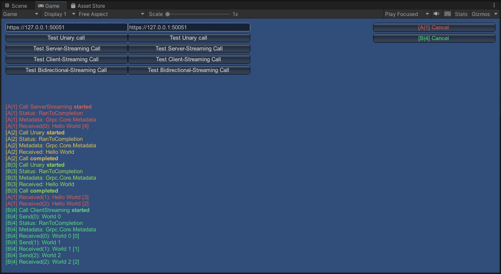

# grpc-dotnet via HTTP2 for Unity


## TODO
 - Verify all supported platforms (iOS, Android, ...)

***Note:** Pull requests improving coverage of functionality are very welcome. But in any case, if you notice the lack of some features or any other issues please open a ticket.*

## Introduction

**Important:** This package requires to have at least version 2.8.2 of [BestHTTP/2 by Tivadar György Nagy](https://assetstore.unity.com/packages/tools/network/best-http-2-155981) [https://github.com/doctorseus/grpc-dotnet-unity/issues/1]!

Up to this point the only way to use gRPC with Unity was to use gRPC.Core. This implementation requires native platform-specific unmanaged libraries to support the HTTP2 communication and as of today is [planned to be deprecated in May 2023](https://grpc.io/blog/grpc-csharp-future/).

[The way forward and future to support gRPC within .NET/C# lays with grpc-dotnet.](https://forum.unity.com/threads/unity-future-net-development-status.1092205/) Unfortunately this new implementation (exclusively using managed code and without any platform-specific requirements) is not compatible with Unity as of now. This is because Unity currently does not support HTTP2 natively until the [move to .NET 6/7](https://forum.unity.com/threads/unity-future-net-development-status.1092205/) is completed.

This package uses the custom [BestHTTP/2](https://assetstore.unity.com/packages/tools/network/best-http-2-155981) package as HTTP2 client to replace the transport layer of grpc-dotnet and enable support of **unary, client-streaming, server-streaming and bidirectional-streams** across supported platforms.

**Important:** Any gRPC server implementation is not supported! Only gRPC client mode.

Apart of the glue code to enable this, this package also includes a test scene and code used to verify gRPC functionality and as an example of usage of the gRPC async API.

Latest versions of grpc-dotnet and additional required dependencies are also included.

The documentation for gRPC and it's API can be found on https://grpc.io/docs/languages/csharp/.

## gRPC Setup

After importing this package also import the latest version of **BestHTTP/2** via the package manager.
When creating a connection with gRPC the only thing required is to provide an instance of `GRPCBestHttpHandler` to `GrpcChannelOptions.HttpHandler` when initiating a new channel.

This will make sure that BestHTTP/2 is used when creating a new HTTP2 channel to the server. 
This class will make sure that all outgoing and ingoing communication from grpc-dotnet is handled by BestHTTP/2.

```
GRPCBestHttpHandler httpHandler = new GRPCBestHttpHandler();
m_Channel = GrpcChannel.ForAddress(ServerAddressInput, new GrpcChannelOptions
{
    HttpHandler = httpHandler
});

m_Client = new HelloWorldService.HelloWorldServiceClient(m_Channel);
```

## Demo Scene

The Demo Scene provides the possibility to send unary, client-streaming, server-streaming and bidirectional-streaming calls to one (or two via a secondary channel) gRPC server. The proto file used for this service can be found in `GRPC.NET/Example/Proto/hello.proto`.


### Demo Server (Java)

This package also includes a gradle based Java gRPC server project (`grpc-example-server/`) for testing purposes with this client.

If you are not familiar with Java, it is recommended to use https://www.jetbrains.com/idea/ to open and run the example server class `net.grpc.example.HelloWorldServer`.

# Release Notes

## FAQ

- *Are connections with **ChannelCredentials.Insecure** supported?*
  - No, BestHTTP does not support plaintext http2 aka "h2c with prior knowledge" which is assumed when gRPC is used with insecure credentials. You will have to setup SSL on your gRPC server.
- *Some versions of external dependencies listed below are deprecated, can I replace them with newer versions?*
  - Yes, although gRPC is build against the versions listed below, they also work with newer versions. However, you might have to disable `Validate References` within Unity if you get a `X references strong named Y, versions has to match.` build error.

## Version 1.2.0
- Fixed handling of metadata and trailing headers. [https://github.com/doctorseus/grpc-dotnet-unity/issues/5]
- Dependencies:
  - grpc.core.api.2.51.0 (netstandard2.1)
  - grpc.net.client.2.51.0 (netstandard2.1) [note: https://github.com/doctorseus/grpc-dotnet-unity/issues/2]
  - grpc.net.common.2.51.0 (netstandard2.1)
  - google.protobuf.3.21.9 (netstandard2.0)
  - system.runtime.compilerservices.unsafe.4.5.2 (netstandard2.0)
  - microsoft.extensions.logging.abstractions.3.0.3 (netstandard2.0)
  - system.diagnostics.diagnosticsource.4.5.1 (netstandard1.3)

## Version 1.1.0
- Updated gRPC to version 2.51.0
- Improved handling of server disconnects / unreachable servers.
- Added support for trailer-only responses (gRPC error handling).
- Added gRPC call cancellation support.
- Dependencies:
  - grpc.core.api.2.51.0 (netstandard2.1)
  - grpc.net.client.2.51.0 (netstandard2.1) [note: https://github.com/doctorseus/grpc-dotnet-unity/issues/2]
  - grpc.net.common.2.51.0 (netstandard2.1)
  - google.protobuf.3.21.9 (netstandard2.0)
  - system.runtime.compilerservices.unsafe.4.5.2 (netstandard2.0)
  - microsoft.extensions.logging.abstractions.3.0.3 (netstandard2.0)
  - system.diagnostics.diagnosticsource.4.5.1 (netstandard1.3)

## Version 1.0.0
- Initial Release
- Dependencies:
    - grpc.core.api.2.50.0 (netstandard2.1)
    - grpc.net.client.2.50.0 (netstandard2.1) [note: https://github.com/doctorseus/grpc-dotnet-unity/issues/2]
    - grpc.net.common.2.50.0 (netstandard2.1)
    - google.protobuf.3.21.9 (netstandard2.0)
    - system.runtime.compilerservices.unsafe.4.5.2 (netstandard2.0)
    - microsoft.extensions.logging.abstractions.3.0.3 (netstandard2.0)
    - system.diagnostics.diagnosticsource.4.5.1 (netstandard1.3)
